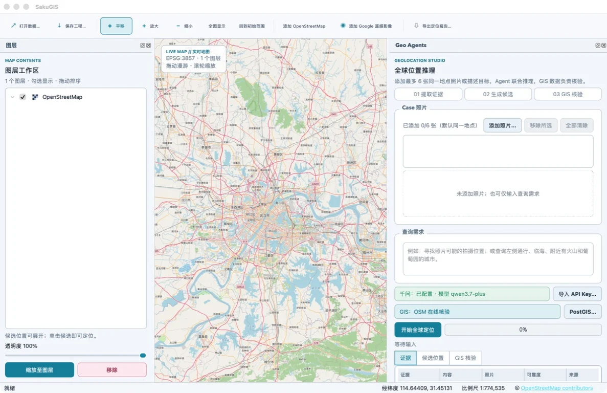
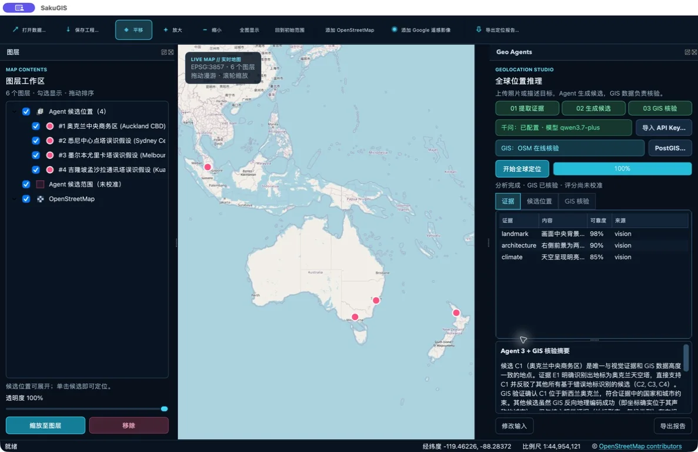
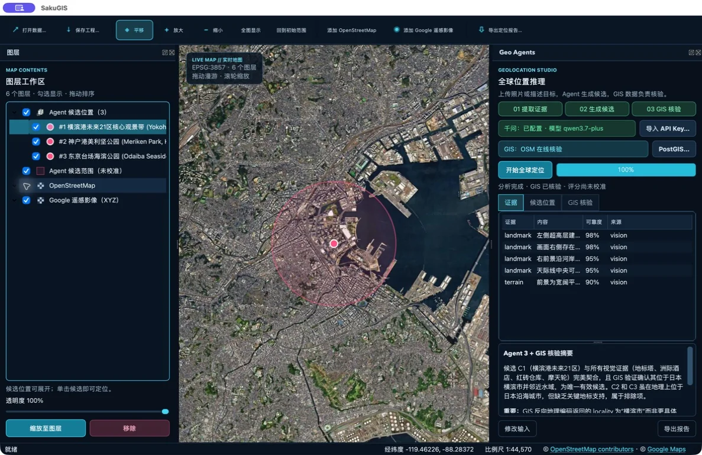
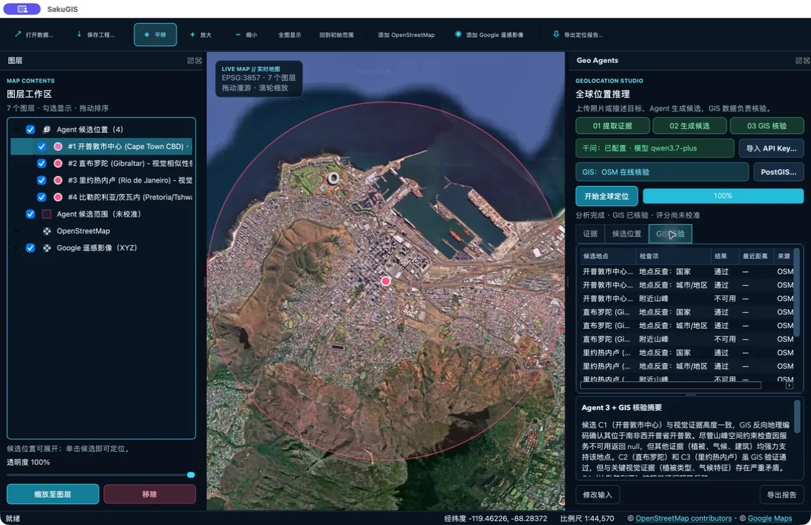
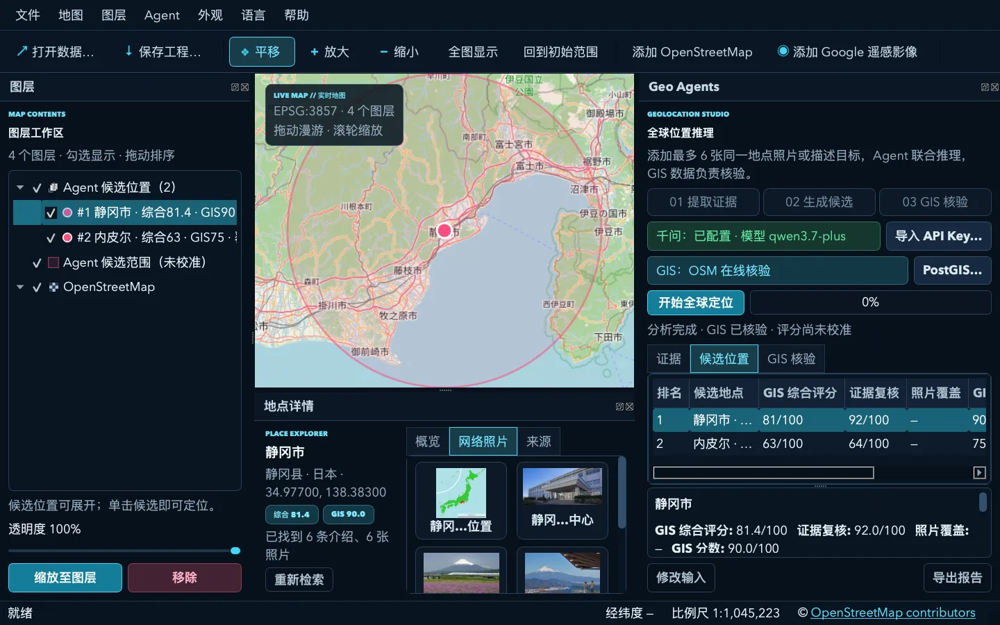
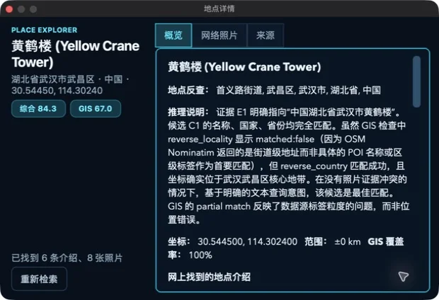
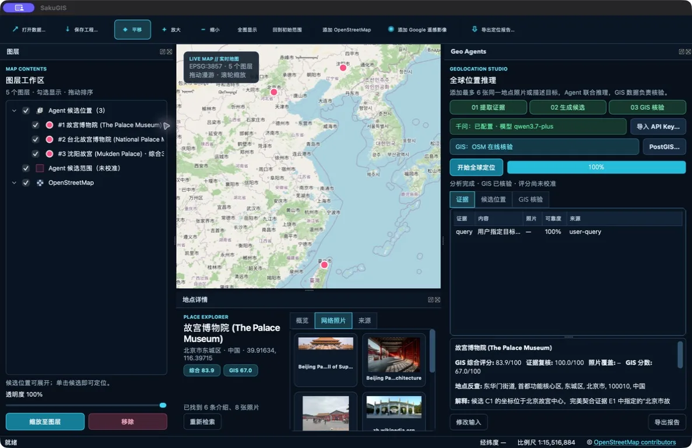
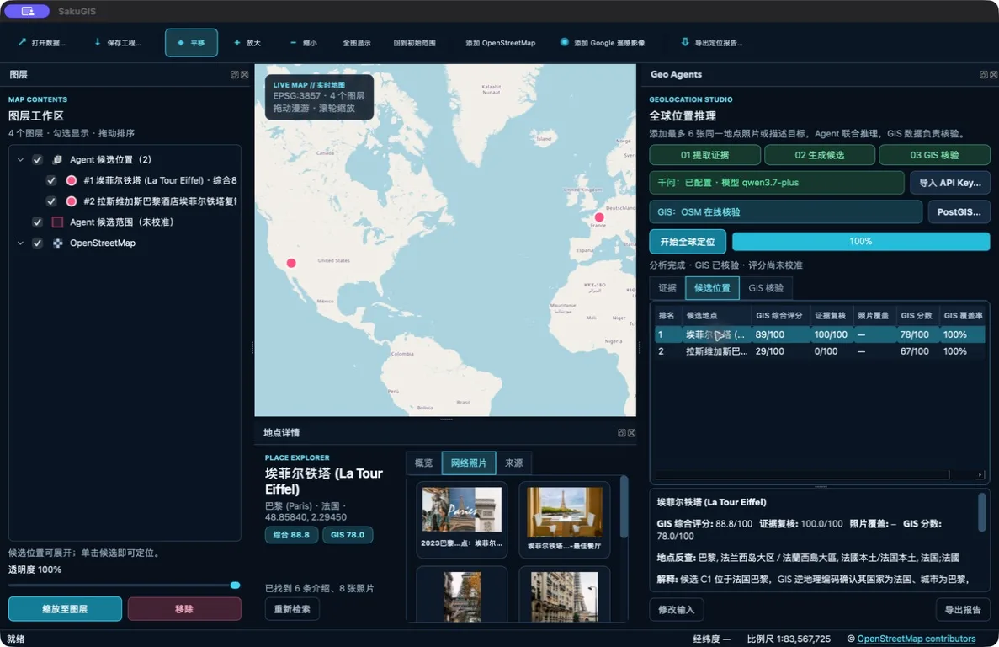
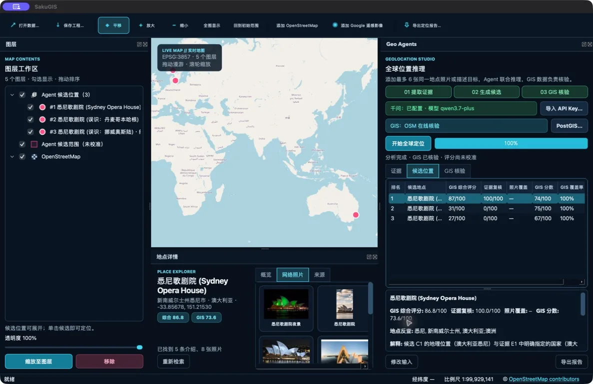

# SakuGIS

[中文说明](README.zh-CN.md) · English

> **Latest release: [Download SakuGIS 0.5.0 for Apple Silicon (.dmg)](https://github.com/whuyao/SakuGIS/releases/download/v0.5.0/SakuGIS-0.5.0-Apple-Silicon.dmg)**<br>
> macOS 13 or later · Apple Silicon only · [Release notes](https://github.com/whuyao/SakuGIS/releases/tag/v0.5.0) · [SHA-256](https://github.com/whuyao/SakuGIS/releases/download/v0.5.0/SakuGIS-0.5.0-Apple-Silicon.sha256.txt)

SakuGIS is an experimental macOS desktop GIS for visual geolocation and
inspectable spatial verification. It combines QGIS, OpenStreetMap, optional
PostGIS, and a three-agent multimodal workflow in a bilingual interface. Qwen
remains the default model provider; Kimi K3 is an optional alternative.

Developed by the [UrbanComp team](https://urbancomp.net).

## Download

The latest installable build is **SakuGIS 0.5.0 for Apple Silicon**.

[Download the latest DMG](https://github.com/whuyao/SakuGIS/releases/download/v0.5.0/SakuGIS-0.5.0-Apple-Silicon.dmg)
·
[SHA-256](https://github.com/whuyao/SakuGIS/releases/download/v0.5.0/SakuGIS-0.5.0-Apple-Silicon.sha256.txt)
·
[Release notes and all assets](https://github.com/whuyao/SakuGIS/releases/tag/v0.5.0)

Version 0.5.0 turns imported vector data into a practical cartography workflow.
It adds QGIS-native symbology for single, categorized, graduated continuous,
and rule-based rendering; searchable attribute tables with map selection; and
professional A4 PDF/PNG output with a title block, legend, north arrow, scale
bar, and production metadata. Native renderers remain replayable in `.sgd`
projects. Qwen, Kimi, and Brave keys and PostGIS connection strings are never
packaged.

The package requires macOS 13 or later and an Apple Silicon Mac. It is about
1.7 GB because it includes an independent QGIS runtime; a separate QGIS
installation is not required. This test build is ad-hoc signed and not
Apple-notarized, so on first launch you may need to right-click SakuGIS in
Finder and choose **Open**.

> SakuGIS is research software. Candidate scores are ranking signals, not
> calibrated probabilities, and should not be used as the sole basis for
> high-stakes decisions.

## Highlights

- QGIS-powered map canvas with pan, zoom, full extent, and project save/load.
- Replayable single-file `.sgd` projects package query text, original input
  photos, all three structured Agent stages, GIS checks and scores, map state,
  supported local GIS data, layer styles, and acquired Brave descriptions,
  displayed photo thumbnails, and source links. Reopening rebuilds the candidate
  markers, uncertainty ranges, and result panels without calling online services.
- Legacy QGIS `.qgz` / `.qgs` open and save-as remain available.
- OpenStreetMap plus replaceable XYZ imagery layers.
- Local GeoJSON, GeoPackage, Shapefile, KML, GeoTIFF, and common GIS formats.
- Layer visibility, ordering, renaming, opacity, and candidate navigation.
- QGIS' native vector symbology editor for point, line, and polygon layers:
  single, categorized, graduated continuous values, rule-based renderers,
  color ramps, symbol layers, transparency, and data-defined properties.
- Native QGIS renderers and legend entries persist in `.sgd` projects.
- Searchable vector attribute tables with row selection linked back to map
  feature selection and zoom-to-selection.
- Professional A4 landscape map export to PDF or PNG with title block, legend,
  north arrow, scale bar, creator, print time, scale, version, sheet number, and
  source summary. Interactive-only Google XYZ imagery is excluded from exports.
- Chinese and English runtime UI.
- Persistent light and dark appearance modes.
- **About SakuGIS** can check GitHub Releases for updates and open either the
  Apple Silicon DMG download or the release notes when a newer build exists.
- Each launch opens on one of 24 major world cities selected at random; the chosen city remains the initial extent for that session.
- Multi-photo Case workspace: jointly analyze up to six photos captured at
  the same location, while retaining single-photo and text-only queries.
  Each photo is sent in its own vision request, then evidence is merged
  locally to avoid multi-image context failures.
- Three-stage agent pipeline:
  1. extract visual and contextual evidence;
  2. propose hypotheses and resolve them through a real place index;
  3. verify and rerank candidates with GIS evidence.
- Selectable Qwen or Kimi K3 model providers. Credentials are isolated in
  provider-specific macOS Keychain entries and Qwen remains the default.
- Kimi K3 image input with configurable Low, High, or Max reasoning effort;
  High is recommended for everyday use and Max is available for difficult cases.
- One stateless retry when a model returns incomplete JSON. K3 receives a
  larger output reserve because mandatory reasoning consumes output tokens.
- Real PostGIS/Nominatim name lookup replaces model coordinates with indexed
  OSM place records. If an alias cannot be resolved safely, coordinate-based
  reverse lookup attaches a real OSM identity without moving the queried point.
- Real OSM Nominatim reverse geocoding and Overpass spatial constraints.
- Optional local PostgreSQL/PostGIS verification with `ST_Covers`,
  `ST_DWithin`, and `ST_Distance`.
- Expandable candidate layers and a click-to-compare panel with composite,
  evidence-review, cross-photo, GIS, and coverage signals.
- Selecting a candidate row, layer, or map marker opens a movable Place
  Explorer window with local GIS evidence, Brave web descriptions, web
  photos, and clickable original sources. It remains hidden unless the
  candidate has both a named GIS identity and online material, and can be
  resized or docked back into the main window.
- Bilingual Markdown query reports with evidence, checks, sources, and
  uncertainty notes.

### `.sgd` projects and replay

`.sgd` is SakuGIS's versioned, single-file project format. Each packaged entry
has a recorded size and SHA-256 digest and is validated before extraction;
path traversal, symbolic links, and incompatible versions are rejected. API
keys, PostGIS DSNs, and other machine credentials are never included. OSM and
Google online tiles retain only their layer definitions and are not cached for
offline use. Only already downloaded web-photo thumbnails are packaged, while
their original image and page URLs remain as provenance. Remote, database, and
unsupported layer sources are reported as unpackaged. See the
[format specification](docs/project-format.md).

## Screenshots

<table>
  <tr>
    <td width="50%">
      
      <br><sub><b>Light workspace</b> — Wuhan was the randomly selected startup city in this screenshot; manage map layers, up to six Case photos, text queries, Qwen status, and the OSM/PostGIS verifier in one window.</sub>
    </td>
    <td width="50%">
      
      <br><sub><b>Global candidate search</b> — geographically diverse hypotheses remain visible as expandable, inspectable QGIS layers.</sub>
    </td>
  </tr>
  <tr>
    <td width="50%">
      
      <br><sub><b>Satellite context</b> — switch imagery layers without leaving the candidate analysis.</sub>
    </td>
    <td width="50%">
      
      <br><sub><b>GIS verification details</b> — review reverse geocoding, spatial checks, scores, coverage, and data sources.</sub>
    </td>
  </tr>
  <tr>
    <td width="50%">
      
      <br><sub><b>Docked Place Explorer</b> — reattach results below the map for continuous candidate comparison.</sub>
    </td>
    <td width="50%">
      
      <br><sub><b>Floating Place Explorer</b> — opens only after a named GIS identity and valid online material are found; drag or resize it without shrinking the map. This live Yellow Crane Tower query returned six descriptions and eight photos.</sub>
    </td>
  </tr>
</table>

### Live global examples

The following captures come from the packaged Apple Silicon application. Each
case completed the three-agent Qwen pipeline, OSM/GIS verification, candidate
comparison, and Brave-backed place-photo discovery. Scores remain uncalibrated
ranking signals.

<table>
  <tr>
    <td width="50%">
      
      <br><sub><b>Beijing Palace Museum</b> — ranked above the Taipei and Shenyang alternatives with an 83.9 composite score and 100% GIS coverage.</sub>
    </td>
    <td width="50%">
      
      <br><sub><b>Paris Eiffel Tower</b> — separated the Paris landmark from the Las Vegas replica with an 88.8 composite score and 78.0 GIS score.</sub>
    </td>
  </tr>
  <tr>
    <td colspan="2">
      
      <br><sub><b>Sydney Opera House</b> — ranked Sydney first and suppressed Copenhagen and Oslo false hypotheses; the details dock loaded five descriptions and eight source-linked photos.</sub>
    </td>
  </tr>
</table>

## Requirements

- Apple Silicon Mac (M1 or later); Intel Macs are not supported
- macOS 13 or later
- QGIS 3.40 or later; QGIS 3.44 LTR is recommended
- The Python, PyQt, and PyQGIS runtime bundled with QGIS

No separate Python package installation is required for development use.

## Run from source

```bash
./scripts/run-dev.sh
```

If QGIS is installed in a non-default location:

```bash
QGIS_APP=/Applications/QGIS.app ./scripts/run-dev.sh
```

## Model API configuration

No API key is included in this repository. Qwen remains the default provider,
while Kimi K3 can be selected under **Settings → Settings…**. Each provider has
its own editable OpenAI-compatible endpoint, model, API key, and Keychain item.
Only the selected provider needs to be configured. Kimi additionally exposes
Low, High, and Max reasoning effort; High is recommended by default. Starting
an Agent analysis opens Settings automatically when the selected provider's key
is missing. Saved changes apply without restarting.

Import an Alibaba Cloud Model Studio CSV profile:

```bash
./scripts/import-api-key.py /path/to/alibaba-cloud-apiKey.csv
```

The key is stored under the Keychain service
`net.urbancomp.sakugis.qwen`. For a temporary development session:

```bash
SAKUGIS_QWEN_API_KEY=your-key \
SAKUGIS_QWEN_BASE_URL=https://dashscope.aliyuncs.com/compatible-mode/v1 \
SAKUGIS_QWEN_MODEL=qwen3.7-plus \
SAKUGIS_QWEN_MAX_PROMPT_CHARS=48000 \
./scripts/run-dev.sh
```

Kimi keys use the separate Keychain service
`net.urbancomp.sakugis.kimi`. Temporary Kimi configuration is also supported:

```bash
SAKUGIS_MODEL_PROVIDER=kimi \
SAKUGIS_KIMI_API_KEY=your-key \
SAKUGIS_KIMI_BASE_URL=https://api.moonshot.cn/v1 \
SAKUGIS_KIMI_MODEL=kimi-k3 \
SAKUGIS_KIMI_REASONING_EFFORT=high \
./scripts/run-dev.sh
```

The default base URL is Alibaba Cloud's public Beijing OpenAI-compatible
endpoint. A workspace-specific endpoint can be provided at runtime through
`SAKUGIS_QWEN_BASE_URL`; it is intentionally not stored in this repository.

The centralized Settings window keeps Qwen, Kimi, and Brave credentials on its
API Services page. It also manages provider selection, models, Qwen
temperature, Kimi reasoning effort, request timeouts, prompt guard, candidate limit, optional
PostGIS DSN, interface language, and light/dark appearance. Non-secret values
are stored in the current user's QGIS settings; credentials and the DSN are
stored only in macOS Keychain. New values are read by the next request.

Model calls are stateless: each stage sends only one system message and the
current Case input, never previous location runs. Agent 1 sends one resized
photo per request; Agents 2 and 3 receive compact structured JSON. Prompt
budgets are 12,000 / 18,000 / 32,000 characters by stage, with a final
48,000-character client guard. The final guard can be adjusted for a
different model using `SAKUGIS_QWEN_MAX_PROMPT_CHARS`. Kimi K3 is a
thinking-only model, so its adapter does not send Qwen's `enable_thinking`
parameter and reserves 6,144 output tokens for High or 8,192 for Max before a
single stateless JSON retry.

Do not commit keys, profile CSV files, PostGIS DSNs, `.env` files, exported
query data, or private photographs. See [SECURITY.md](SECURITY.md).

## Place descriptions and web photos

Candidate details use Brave Web Search and Image Search in background threads,
so map interaction remains responsive. Every web result and image links to its
original page. Images are search-related references, not confirmed capture
locations, and remain subject to the original publisher's rights. During a
session, results use a short-lived memory cache. An explicit `.sgd` save embeds
the acquired descriptions, provenance URLs, and displayed thumbnail bytes so
the case can be replayed offline. Image discovery expands the search pool, removes obvious
retail, liquor, toy, model, and shopping-page noise, and limits repeated
results from one source page to improve diversity. This filtering is heuristic
and does not replace source review. The Place Explorer is shown only when GIS
verification provides a named place identity and Brave returns at least one
valid description or image; otherwise SakuGIS keeps the candidate on the map
and displays only a brief no-results status message.

Brave is optional and can be configured from **Settings → Settings…**.
Without it, GIS geolocation and candidate scoring still run, but SakuGIS does
not open web descriptions or photo results. A local text file can also be
imported into macOS Keychain:

```bash
./scripts/import-brave-key.py /path/to/brave-key.txt
```

The Keychain service is `net.urbancomp.sakugis.brave`. For a temporary
development session, use `SAKUGIS_BRAVE_API_KEY` or
`BRAVE_SEARCH_API_KEY`.

## GIS verification

Without additional configuration, SakuGIS uses:

- Nominatim Search to resolve Agent 2 hypotheses to real OSM place records,
  with distance guards against far-away same-country false matches;
- coordinate-based Nominatim reverse lookup as a low-similarity alias fallback;
- Nominatim for country, region, locality, and reverse-geocoding checks;
- Overpass for bounded checks around coastlines, peaks, volcanoes, vineyards,
  waterways, stations, and related OSM features;
- coverage-aware scoring so timeouts and unavailable data remain unknown
  instead of being treated as mismatches.

For production or batch workflows, connect a local OSM-backed PostGIS
database from **Settings → Settings… → GIS**. The local backend uses multilingual
`pg_trgm` name indexes for place lookup before spatial verification. The DSN
is stored in the macOS Keychain. See [docs/postgis.md](docs/postgis.md).

## Satellite imagery

The current prototype includes a replaceable custom XYZ definition for
interactive satellite visualization. It is isolated from the agent and GIS
verification pipeline.

The legacy Google tile endpoint used by the prototype is not a supported
endpoint in the current Google Maps Tile API documentation. Deployers are
responsible for confirming availability and usage rights, and should replace
it with an officially supported provider configuration for production.

## Tests

The non-GUI tests can run with the system Python:

```bash
PYTHONPATH=src python3 -m unittest discover -s tests -v
```

Runtime checks that depend on QGIS can be run with:

```bash
./scripts/check-runtime.sh
./scripts/check-agent-pipeline.py
```

For repeatable live multimodal regression, provide a JSON manifest containing
local image paths, queries, expected coordinates, and Top-1/Top-3 distance
thresholds:

```bash
PYTHONPATH=src python3 scripts/regression-multimodal.py \
  --manifest /path/to/regression-manifest.json \
  --output-dir ./regression-output \
  --language zh_CN
```

The 2026-07-28 release regression covered five distinct scenes: Shanghai
waterfront (two photos), Mount Fuji and a pagoda (three photos), Erg Chebbi
dunes, Jökulsárlón glacier lagoon, and Rio de Janeiro's Sugarloaf Mountain.
All 5/5 core runs and 5/5 web-enrichment runs passed. The final run resolved
17/17 candidates to real place records, issued 18 stateless Qwen requests with
zero retries, and verified that every photo contributed visual evidence.

## Build the macOS application

Generated `.app`, DMG, QGIS runtime, and generated `.icns` files are
deliberately excluded from Git. The packaging script creates the icon from
`resources/icon.svg` when necessary and rejects QGIS runtimes without arm64.

Build a locally runnable application:

```bash
./scripts/package-macos.sh \
  --qgis-app /Applications/QGIS.app \
  --output-dir ./build \
  --app-only
```

Build a DMG:

```bash
./scripts/package-macos.sh \
  --qgis-app /Applications/QGIS.app \
  --output-dir ./dist
```

See [docs/packaging.md](docs/packaging.md) for signing and notarization.

## Project layout

```text
src/sakugis/   application source
resources/     Info.plist and vector artwork
scripts/       development, verification, and packaging scripts
launcher/      native macOS launcher source
tests/         non-GUI unit tests
docs/          architecture and deployment documentation
```

Additional design documents:

- [Architecture](docs/architecture.md)
- [Geolocation agents](docs/geolocation-agents.md)
- [PostGIS backend](docs/postgis.md)
- [Report format](docs/reporting.md)
- [Packaging](docs/packaging.md)

## License

SakuGIS is released under
[GNU GPL-2.0-or-later](LICENSE). QGIS and bundled runtime components retain
their respective licenses. See [THIRD_PARTY_NOTICES.md](THIRD_PARTY_NOTICES.md)
for redistribution obligations.
